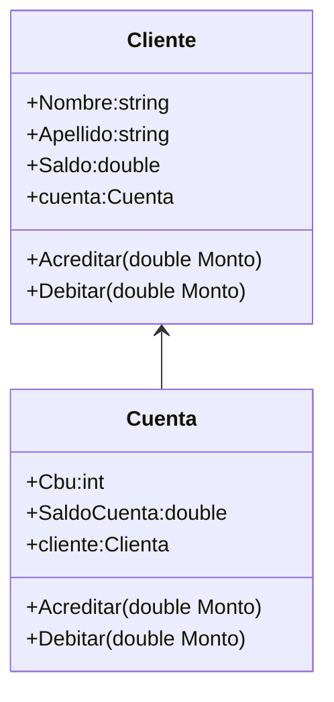

# Banco

```mermaid
classDiagram

class Cliente{

    +Nombre:string
    +Apellido:string
    +Saldo:double
    +cuenta:Cuenta
    +Acreditar(double Monto)
    +Debitar(double Monto)

}
Cliente<--Cuenta
class Cuenta{
    +Cbu:int
    +SaldoCuenta:double 
    +cliente:Clienta
    +Acreditar(double Monto)
    +Debitar(double Monto)
}
    


```