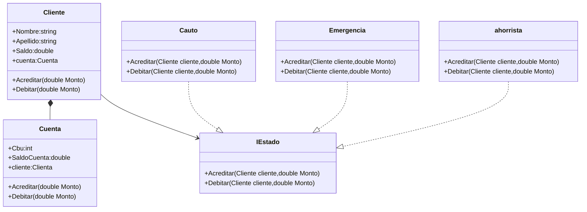

# Banco

```mermaid
classDiagram

class Cuenta{
    +Cbu:int
    +SaldoCuenta:double 
    +cliente:Clienta
    +Acreditar(double Monto)
    +Debitar(double Monto)
}
Cliente *-- Cuenta
class Cliente{

    +Nombre:string
    +Apellido:string
    +Saldo:double
    +cuenta:Cuenta
    +Acreditar(double Monto)
    +Debitar(double Monto)

}
Cliente --> IEstado

class  IEstado{
    <Interface>

    +Acreditar(Cliente cliente,double Monto)
    +Debitar(Cliente cliente,double Monto)
}
Cauto..|>IEstado
Emergencia..|>IEstado
ahorrista..|>IEstado
class Cauto{
    +Acreditar(Cliente cliente,double Monto)
    +Debitar(Cliente cliente,double Monto)

}
class Emergencia{
    +Acreditar(Cliente cliente,double Monto)
    +Debitar(Cliente cliente,double Monto)
}
class ahorrista{
    +Acreditar(Cliente cliente,double Monto)
    +Debitar(Cliente cliente,double Monto)

}


```